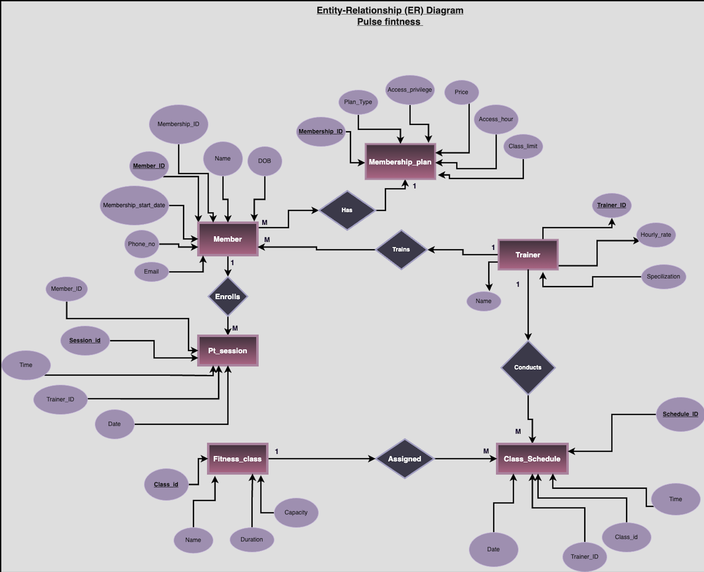
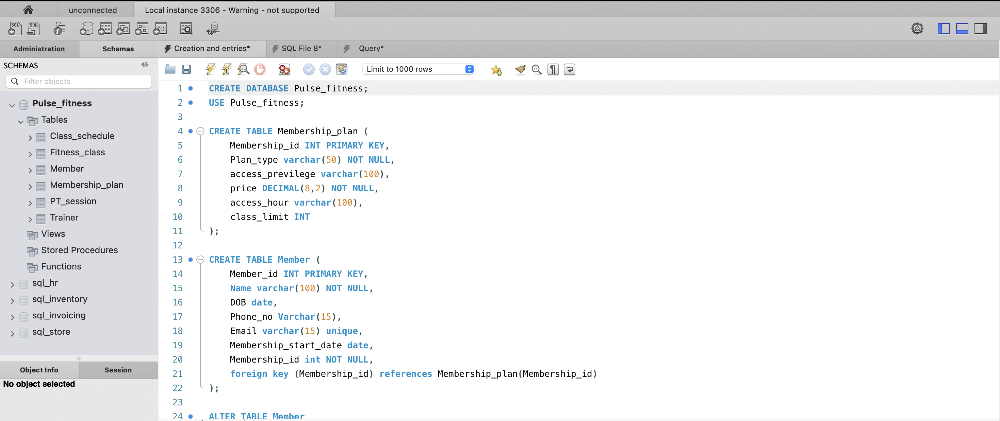
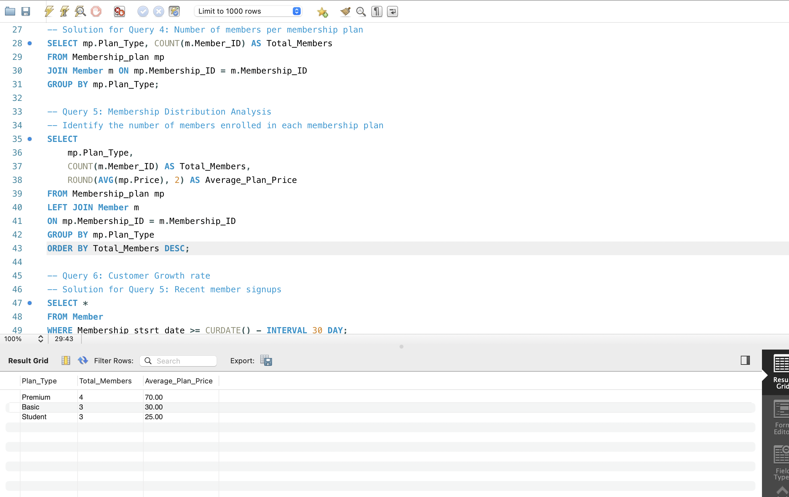
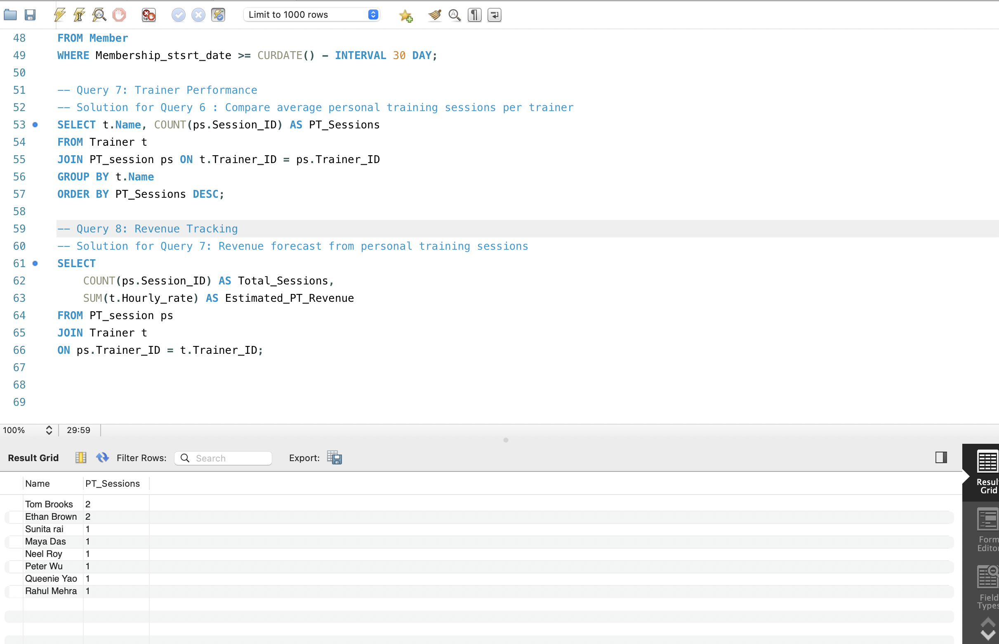

# Pulse-Fitness-Data-Analytics-System

## Project Overview

The goal of this project was to design and implement a relational database system for Pulse Fitness, a modern fitness center offering memberships, personal training sessions, and group fitness classes.

The project demonstrates SQL database design, data modelling, business analytics, and reporting skills. The database was created to support operational management and generate insights to improve customer engagement, resource allocation, and revenue growth.

## Project Objectives
- Design a relational database for a fitness center
- Implement tables, relationships, and constraints using SQL
- Populate the database with realistic sample data
- Perform business analysis using SQL queries
- Generate insights to support management decision-making

## Tools Used
- SQL
- MySQL
- Draw.io
- GitHub
- Microsoft Word

## Dataset Entities
- Members
- Membership Plans
- Trainers
- Fitness Classes
- Personal Training Sessions
- Payments
- Attendance Records

## Project Screenshots

### ER Diagram

### Database Schema

### Membership Analysis Query

### Trainer Workload Query

